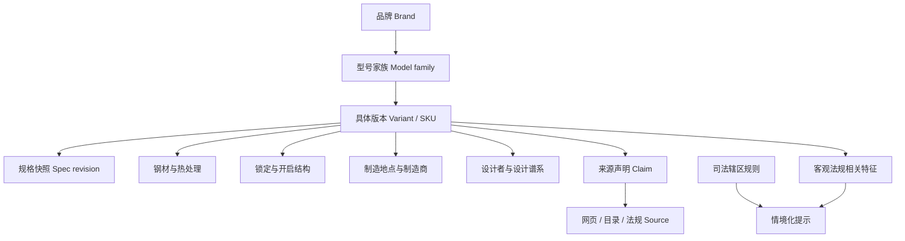

# 专家补充研究框架

用户已经提出行业、知名产品、属性和来源。要把一次调研变成可长期运营的知识项目，还需要以下信息。

## 1. 先回答项目要服务谁

至少区分四种读者：新手（概念和安全）、使用者（任务匹配）、爱好者（材料/结构/版本）、收藏者（年份、稀缺性、真伪和状态）。同一产品页可共用事实层，但解释和默认排序不同。

建议新增匿名访谈或问卷：使用场景、所在地区、已有刀具、预算、最困惑字段、是否拆洗/磨刀、对法律提示的需求。没有这层，行业报告无法证明真实产品需求。

## 2. 必须新增的数据字段

### 身份与版本

- `brand`、`model_family`、`variant_name`、`sku/catalog_no`
- `introduced_year`、`discontinued_year`、`spec_valid_from/to`、`as_of`
- `designer`、`brand_country`、`design_country`、`manufacturing_country`、`assembly_country`

### 刀刃与切割

- 刃长、切削刃长、刃厚、刃高、总长、闭合长（均用 mm 原始数值）
- 刃形、磨型、开刃角、刃后厚度、表面处理、齿刃比例
- 钢材规范化名称、钢厂、HRC 范围、热处理方（如公开）
- 注意：钢材性能评分必须绑定测试方法，不能把营销形容词转成数值。

### 机械与携带

- 锁型、锁定方向/左右手适配、枢轴/垫片或轴承
- 开启器、是否自动、是否辅助、可否单手
- 口袋夹方向、深携、孔位、是否附鞘
- 重量、柄厚、柄材、衬片、背隔柱/背板

### 使用与维护

- 主要/次要任务、耐蚀维护、拆解难度、磨刀难度、建议安全注意
- 保修期限、磨刀服务、零件可得性、官方拆解政策
- 包装内容与可持续性信息（木材认证、可替换零件、使用寿命）

### 市场与文化

- 发布价格、当前 MSRP、币种、地区、日期；停产后与二级市场价分开
- 设计奖项、专利/商标、重要采用、销量主张及其出处
- 仿品风险、识别特征、日期码/钢印、收藏版本关系
- 争议历史、文化背景与命名来源，避免只复制品牌神话。

### 法规事实，而非结论

- 客观结构：锁定、自动/辅助、双刃、刀尖、刃长/切削刃长
- 司法辖区规则单独成表：`jurisdiction`、`rule_type`、`effective_date`、`official_source`、`reviewed_by`
- 永远不设置跨地区通用 `is_legal`。

## 3. 需要补做的研究

| 研究 | 为什么重要 | 最小可行做法 | 优先级 |
|---|---|---|---:|
| 用户访谈与任务分类 | 验证网站不是只服务参数党 | 访谈 12–20 人，覆盖新手/户外/收藏/EDC | P0 |
| 型号版本谱系 | 防止同名参数串线 | 先为 110、PM2、Bugout、Sebenza、Elementum 建版本树 | P0 |
| 法规信息架构评审 | 避免“合法”误导 | 请熟悉目标地区的专业人士审阅模板 | P0 |
| 来源与事实审计 | 建立可信度 | 抽查首批 30 款，每条核心字段双人复核 | P0 |
| 中文术语表 | 提升搜索与一致性 | 建中英别名、钢材别名、锁型规范名 | P1 |
| 实测协议 | 区分厂商规格与实物 | 统一卡尺、秤、HRC/切割测试的样本与误差记录 | P1 |
| 市场规模自下而上估算 | 补足公开报告缺口 | 选 5 地区、20 渠道、50 SKU 做价格与销量代理样本 | P1 |
| 价格与停产追踪 | 服务收藏与版本研究 | 保存 MSRP 快照，不抓取不可验证的成交传闻 | P2 |
| 真伪资料 | 经典款仿品多 | 只引用品牌/授权渠道，记录钢印、包装与日期码 | P2 |
| 可持续与可维修性 | 构成长期价值 | 记录材料认证、维修、备件、保修、产地透明度 | P2 |

## 4. 推荐的数据关系

关键原则是“来源不直接挂在整把刀上”，而应尽量挂在具体声明或规格快照上。一个官网链接可能证明重量，却不能自动证明首发年份或文化影响。

## 5. 建议的首批内容策略

1. 先做本研究 12 款的完整版本卡，而不是快速铺 500 款空壳数据。
2. 增补 8–18 个谱系锚点：Mercator K55K、Laguiole（作为类型而非单品牌）、Mercator/Case、Spyderco Delica、Benchmade 940、Ontario RAT 1、Kizer/CJRB 代表款、Leatherman Wave、传统中国小刀工艺等。
3. 同步建立 8 个锁型和 12 种常见钢材解释页；每页讲“取舍与适用”，不做绝对排名。
4. 内容上线门槛：身份、版本、至少一条一手来源、核心规格、结构、产地、来源日期、安全提示齐全。

## 6. 项目成功指标

不要只看收录数量。更有意义的指标是：

- 核心字段一手来源覆盖率；失效链接率；过期规格率；双人复核率；
- 型号版本误合并率；术语规范命中率；用户纠错关闭时间；
- 用户从产品到钢材/锁型/设计师的探索深度；任务比较完成率；
- 法规提示的更新时间和司法辖区覆盖，而不是“合法刀款数”。

## 7. 最重要的专家判断

这类项目最大的敌人不是资料少，而是**不同层级的事实被揉成一条记录**：品牌故事当历史事实、型号家族当具体 SKU、钢材理论值当成品性能、某地规则当全球结论、当前官网规格覆盖旧批次。只要把声明、版本、来源和时间四者绑定，KNIFE WORLD 就能形成真正难复制的知识资产。
